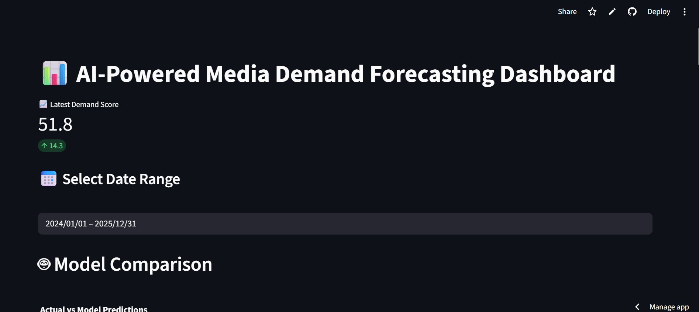
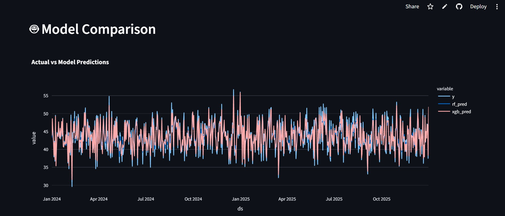
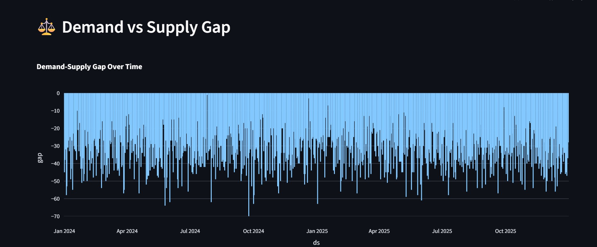

# 🎬 AI-Powered Streaming Intelligence Platform

## 🌐 Live Demo  
https://ai-media-demand-forecasting-mnxhfqnuaadqxw2mwxjgpk.streamlit.app/

## 🚀 Overview

An end-to-end AI-driven analytics system that forecasts media demand and identifies content gaps using user behavior, engagement data, and machine learning models.

This project combines **multi-source data engineering, machine learning, and interactive visualization** to provide actionable insights for content strategy and demand planning.

---

## 🎯 Key Features

* 📊 Demand Forecasting using Prophet (time-series modeling)
* 🤖 Machine Learning Models: Random Forest & XGBoost
* 📉 Model Performance Comparison (MAE evaluation)
* 🔍 Demand-Supply Gap Analysis (search vs recommendations)
* 📈 Interactive Streamlit Dashboard
* 🧠 Business Insights for decision-making
* 📦 Multi-source Data Integration:

  * Google Trends
  * Search logs
  * Recommendation logs
  * Reviews & engagement data

---

## 🧠 Business Impact

This system enables:

* Identification of **unmet demand** in content categories
* Optimization of **recommendation systems**
* Data-driven **content investment decisions**
* Improved **user engagement strategies**

---

## 🧰 Tech Stack

* **Languages:** Python
* **Libraries:** Pandas, NumPy, Scikit-learn
* **ML Models:** Prophet, Random Forest, XGBoost
* **Visualization:** Plotly, Streamlit
* **Data Sources:** PyTrends + simulated streaming datasets

---

## 📊 Dashboard Preview





---

## 📁 Project Structure

```
AI-Media-Demand-Forecasting/
│
├── app/
│   └── app.py                # Streamlit dashboard
│
├── src/
│   ├── data_collection.py
│   ├── preprocessing.py
│   ├── feature_engineering.py
│   ├── model.py
│
├── data/                     # Raw & processed datasets
├── outputs/                  # Model outputs
│   ├── forecast.csv
│   ├── model_comparison.csv
│
├── requirements.txt
└── README.md
```

---

## 🔄 Workflow

1. **Data Collection**

   * Google Trends + user activity data

2. **Feature Engineering**

   * Aggregated demand signals
   * Created demand score & gap metrics

3. **Modeling**

   * Prophet (time-series baseline)
   * Random Forest & XGBoost

4. **Model Evaluation**

   * Compared models using MAE

5. **Visualization**

   * Interactive dashboard with insights

---

## ⚙️ How to Run

```bash
git clone https://github.com/SamrudShetty/AI-Media-Demand-Forecasting.git
cd AI-Media-Demand-Forecasting

pip install -r requirements.txt

python src/feature_engineering.py
python src/model.py
streamlit run app/app.py
```


---

## 🔮 Future Enhancements

* 🤖 GenAI-powered chatbot for querying insights
* ☁️ Cloud deployment (AWS / Streamlit Cloud)
* 📊 Power BI dashboard integration
* 🔄 Real-time data pipelines

---

## 💼 Real-World Applications

* OTT platforms (Netflix, Prime Video)
* Content recommendation engines
* Marketing & trend analysis
* Demand forecasting & planning

---

## 👨‍💻 Author

**Samrud Shetty**
GitHub: https://github.com/SamrudShetty

---

⭐ If you find this project useful, consider giving it a star!
